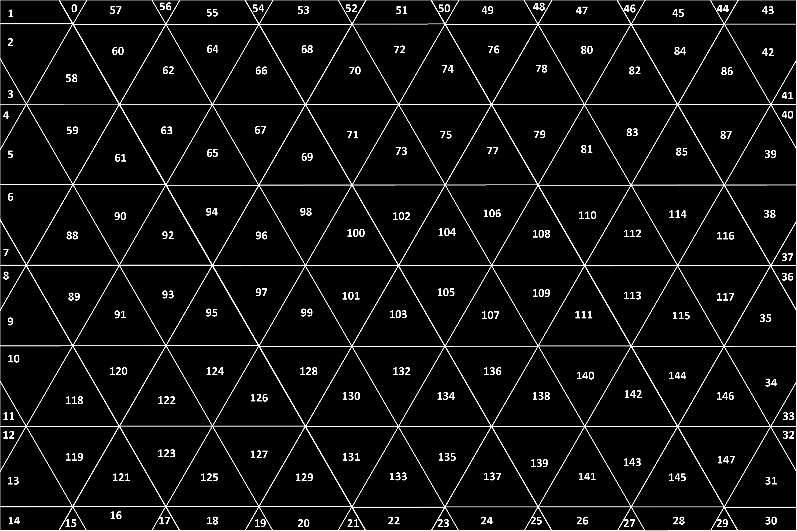
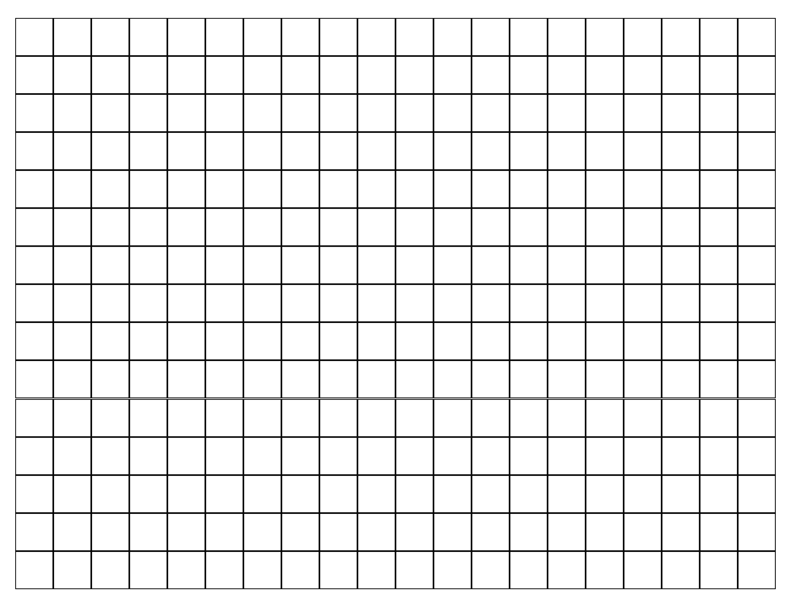

# 300

## Overview

https://www.youtube.com/watch?v=8MXdJdToxZw

300 is a Graphical Interactive Experience built with P5.JS Library and Angular.JS 8 Framework, hosted on Github Pages.

### Human Computer P5.JS element

https://editor.p5js.org/jaemnkm/sketches/NS8xQKwvy

Manually assorted triangles and quadrangle layed out in the following design with P5.JS.

On User Interaction Mouse Press Event, Triggers Mouse Click event.

        /* Mouse Pressed Event */
        if (p.mouseIsPressed){
        /* Mouse Click Event */
        mouseClicked();
        }

Mouse Click Event runs randomizeColor and randomizeStrokeColor functions.

      function randomizeColor() {
        for (let i = 0; i < 148; i++) {
          rgbArr[i] = { R: p.random(255), G: p.random(255), B: p.random(255) };
        }
      }
      function randomizeStrokeColor() {
        for (let i = 0; i < 148; i++) {
          rgbArr[i] = { R: p.random(255), G: p.random(255), B: p.random(255) };
        }
      }

### Angular.JS 8

https://github.com/jaemnkm/300/blob/master/angularApp/src/app/human-computer/human-computer.component.ts

Create Angular Component with P5.JS element.

    <app-human-computer></app-human-computer>

Add 300 components in the following 20 by 15 grid formation.

Each component styled by global styles located in following dir:

    /src

Component width and height css styling and override:

    width: 5% !important;
    height: 5% !important;

### Human Computer Component

Change display to contents, to stack.

human-computer.component.html

    

human-computer.component.css

    #computer-div {
        display: contents;
    }

### Graphic Performance

## Link

https://jaemnkm.com/300/angularApp/