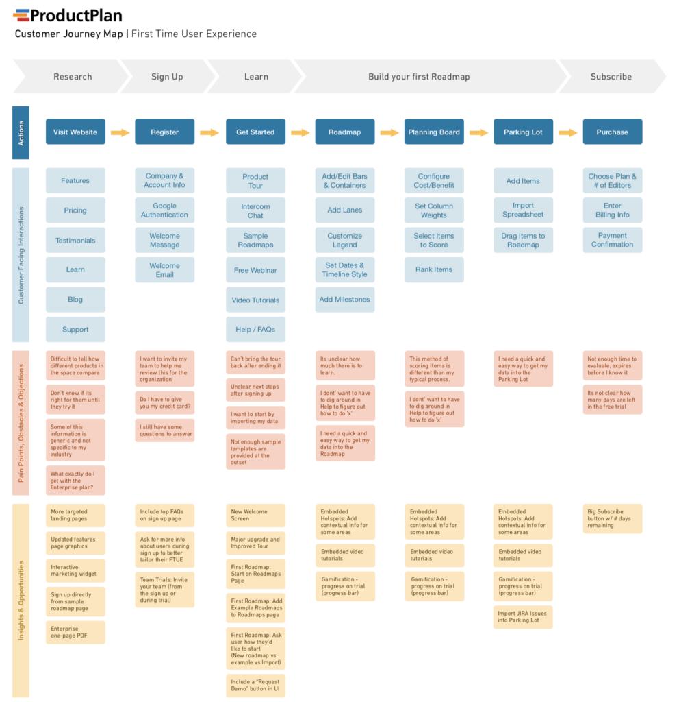

# Interactive Kiosk UI

## Context

Amazon lockers and Craiglist have developed a service that will help people sell their unwanted electronic possessions using a new type of interactive kiosk.

## Source Code

Development of the prototype in React.JS.

## Directive

### High Importance:

Touchscreen Interface User Flow

- Seller

- Buyer

Interactive Wireframe Mock-Up

- Kiosk Touchscreen Interface

- Up to Payment screen

Fully Functional Prototype

- HTML/CSS/JavaScript

- Fullscreen API

### Medium Importance

User Experience

- Seller

- Buyer

Here is an example of the customer journey map.

User Testing

- A/B Testing for Interface

Documentation

- Github Repo / Interface Development

- CSV/Graphs of Data from test / Design process based on user testing

### Low Importance

1:1 Foam-Board

Printed Graphics
